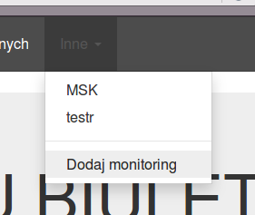
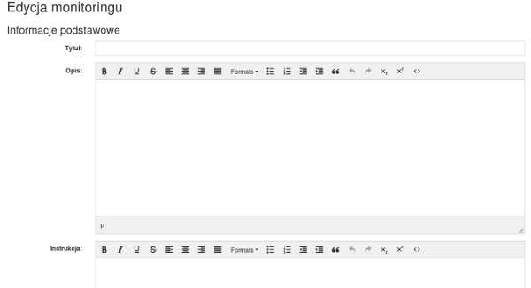
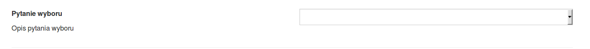
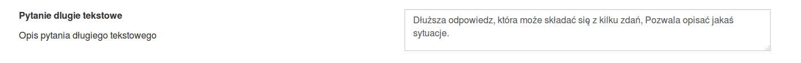
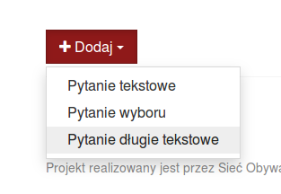
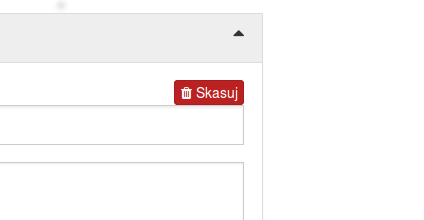
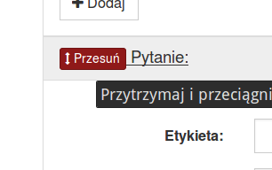
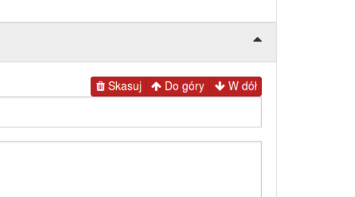
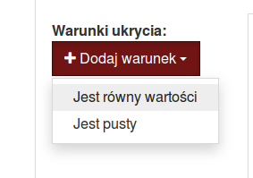
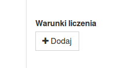

# Tworzenie monitoring
Aby utworzyć ankiety należy być użytkownikiem z odpowiednimi uprawnieniami. Nie wszyscy użytkownicy zarejestrowani w systemie mogą tworzyć ankiety. 

1. Uruchamiamy formularz tworzenia pytań. W tym celu wybieramy z menu górnego `Inne`, a następnie `Dodaj monitoring`

2. Uruchomi się edytor monitoringu, który pozwoli utworzyć nowy monitoring

## Wprowadzanie informacji podstawowych 
1. Rozpoczynam o wpisania w pole `Tytuł` tytułu monitoringu.
2. W kolejnym polu `Opis` wpisujemy opis monitoringu, który pojawi się na głównej podstronie monitoringu. 
3. Kolejne pole to `Instrukcja`. Wartość tego pola pojawia się nad ankietą podczas rozwiązywania jej.

## Wprowadzanie pytań
Aplikacja obsługuje 3 rodzaje pytań: 
* Pytania tekstowe - krótkie pole tekstowe. Pozwala wpisać 1-2 słowa. 

    

* Pytanie wyboru - pozwala na wybranie pytania z listy wyboru. 

    

* Pytanie długie tekstowe - pozwala na wprowadzanie dłuższego opisu składający się z kilku zdań. 

    

### Dodawanie pytań
W celu dodania pytania należy wybrać przycisk w `Dodaj` na dole podstrony, a następnie wybrać odpowiednia formę pytania. Spwooduje to wyświetlenie się nowego pytania na liście pytań. 

Potem nalezy uzupełnić informacje o pytaniu
1. W polu etykieta `Etykieta` wpisujemy treść. Wyświetla się ono w pogrubioną czcionką użytkownikowi

    

2. W polu `Opis` wpisujemy dokładniejsze instrukcje wyjaśniajace pytania. Informacja ta pojawia się pod pytaniem. 
3. W przypadku pytania wyboru konieczne też jest [dodanie opcji wyboru](#dodawanie-opcji-wyboru-dla-pytań-wyboru).
4. Mozliwe jest również warunkowe ukrywanie pytań w tym celu należy [dodać warunki ukrycia](#dodawanie-warunk%C3%B3w-ukrycia).
4. Aby możliwe było obliczenie oceny należy [dodać warunki liczenia](#dodawanie-warunków-liczenia).

### Kasowanie pytań
W celu skasowania pytania należy odtowrzyć pytanie, a następnie wybrać opcje `Skasuj` w prawej strony. 

### Przesuwanie pytań.
Istnieją dwa sposoby przesuwania pytań. 
* metodą "przeciągnij i upuść" (ang. drag-and-drop) poprzez przytrzymanie przycisku `Przesuń` przy ankiecie, a nastpnie ułożęnia na odpowiednia pozycje

    

* przez przyciski `Do góry`/`W dół` znajdujące się obok przycisku `Skasuj`. Naciśniecie przycisku `Do góry` spowoduje, że aktualna pytanie zamieni się miejscem z pytaniem wyżej. Analogicznie jest przyciskiem `W dół`.

    

### Dodawanie opcji wyboru dla pytań wyboru
W przypadku pytań wyboru konieczne jest również dodanie conajmniej 2 opcji wyboru.  

### Dodawanie warunków ukrycia
Obsługiwane są dwa rodzaje warunków ukrycia:
* `Jest równy wartości` - powoduje pokazanie pytania, gdy inne pytanie nie ma podanej wartości tj. w przypadka pytania tekstowego lub pytania długiego tekstowego odpowiedź jest równa danej wartości, **a w przypadku pytania wyboru klucz odpowiedzi jest równy danej wartości**.
* `Jest pusty` - powoduje ukrywanie aktualnego pytania, gdy do wybranego pytania nie jest podana wartość tj. w przypadku pytania tekstowego lub pytania dlugiego tekstowego odpowiedź jest pusta, a w przypadku pytania wyboru nie jest wybrana żadna opcja. 

1. Wybierz opcje `Dodaj warunek` pod napisem `Warunki ukrycia`, a następnie wybierz odpowiedni rodzaj warunku.  

    

2. W polu `Pytanie` wybierz pytanie, które wartość ma być odczytana, aby ukryć aktualne pytanie. 
3. W przypadku warunku `Jest równy wartości` koniecznie jest również podanie wartości, która ma być sprawdzana. 

### Dodawanie warunków liczenia
1. Wybierz opcje `Dodaj` pod napisem `Warunki liczenia`

    

2. W polu `Punkty` wybierz liczbę punktów, która zostanie przyznana. Pole może przyjmować wartości od 1 do 5. 
3. W przypadku pytania tekstowego lub pytania długiego tekstowego wpisz w polu `Wartość`tekst, który ma spowodować przyznanie punktów. Cały odpowiedź musi być równa, aby przyznano punkt. 
3. W polu `Wartość` w przypadku pytania wyboru wpisz `klucz`, który ma spowodować przyznanie punktów.
